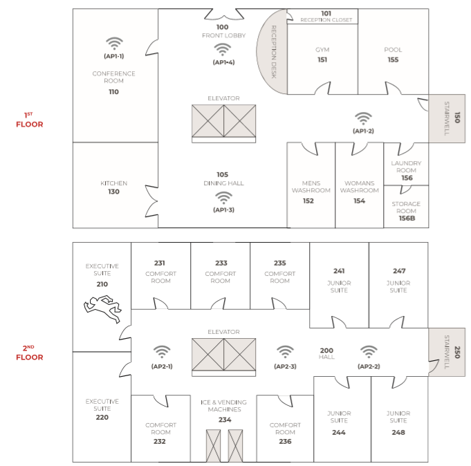
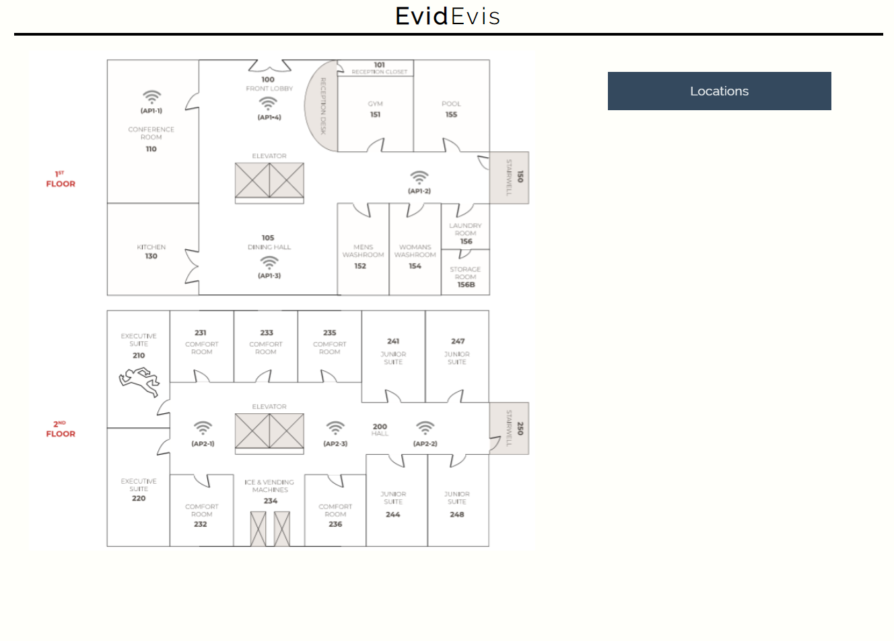
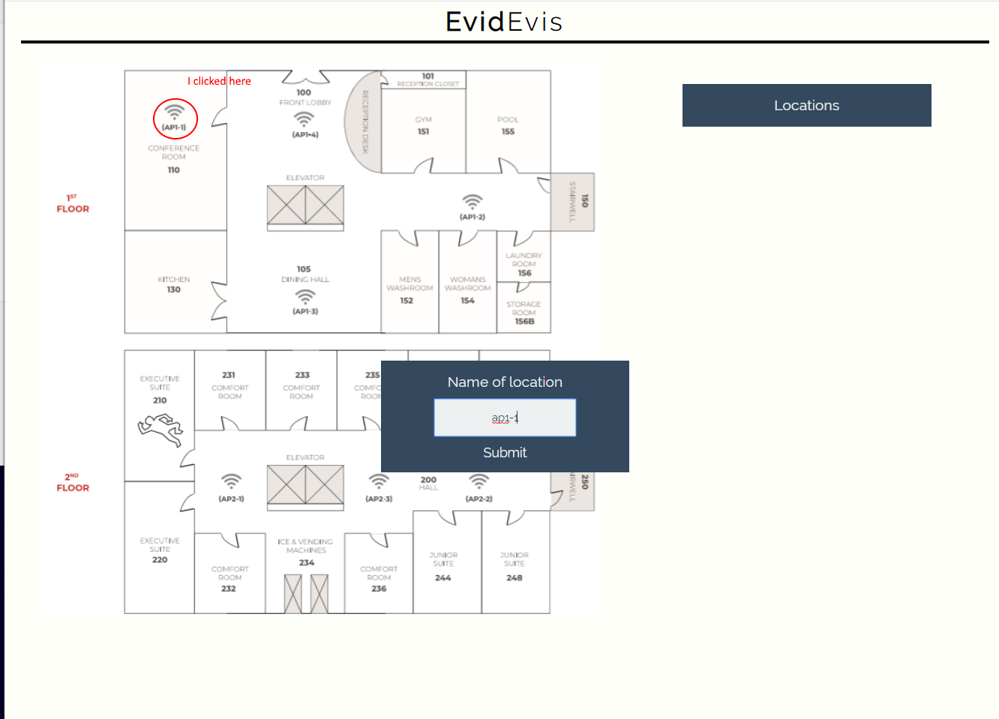
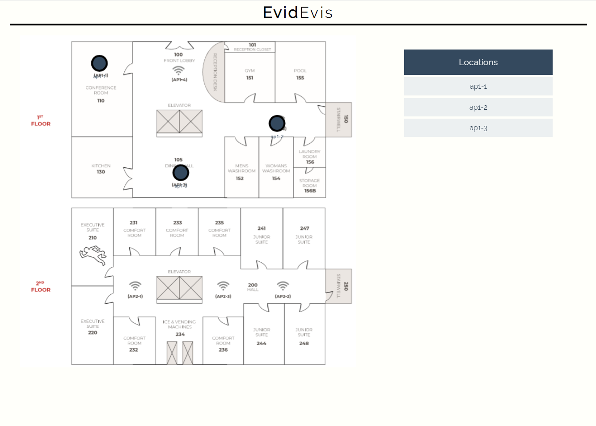
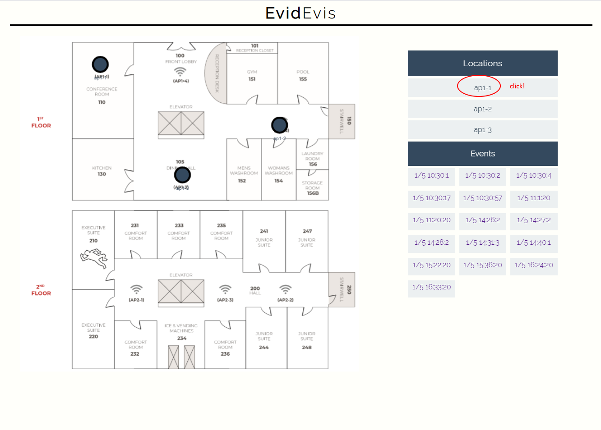
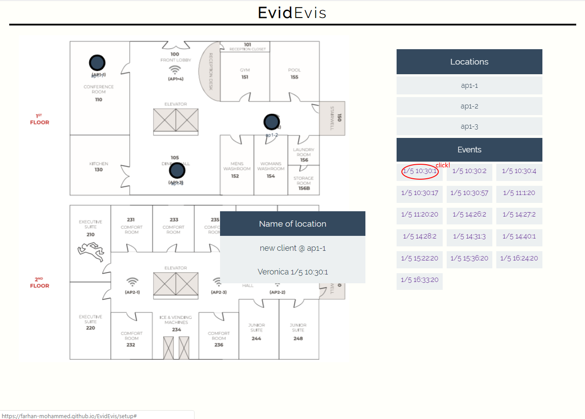

How to Demo:

1. Visit: https://farhan-mohammed.github.io/EvidEvis/

2. Create Setup

3. Upload this image:

4. Your Website should look like this:

5. You can click anywhere on the map to create pins, and then enter their names (case sensitive) and press submit

You can create pins of:
- people
- Door/Phone Sensors "200" "232"
- Wifi Sensors
- Motion Sensors at elevators "elevaor" "stairwell"

This is how it should look like now

Go ahead and add more points, and then click on one of them

It shows you a list of events that are related to what you just clicked

Then click on the date and time to get exact details of that event

---
The database was setup on a json-server for easy setup and querying!